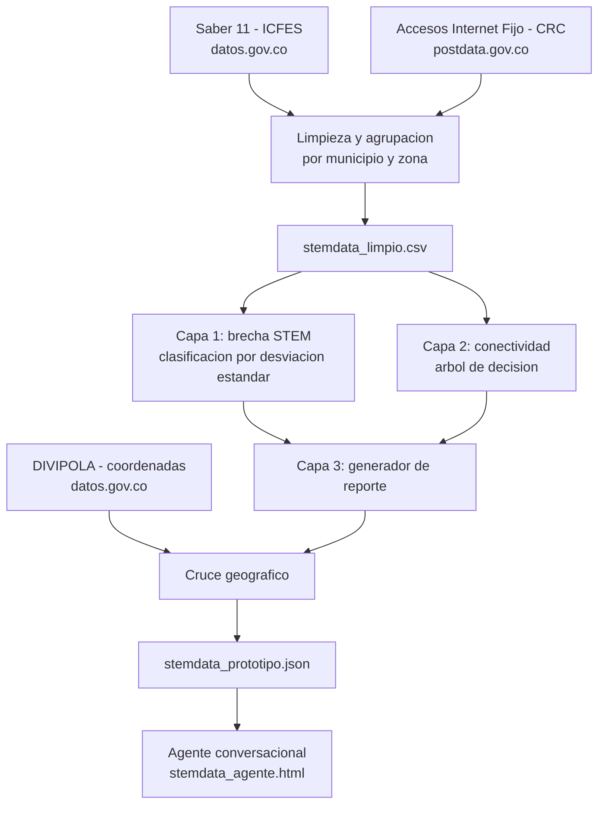

# Arquitectura del proyecto

## Diagrama de flujo

## Descripción de cada etapa

**Fuentes de datos.** Dos datasets de análisis (Saber 11 y conectividad) más una tabla de referencia geográfica (coordenadas de municipios), documentados con enlace y entidad responsable en `fuentes_datos.md`.

**Limpieza y agrupación** (`notebooks/STEMData_Limpieza_Python.ipynb`). Se agrupa Saber 11 por municipio y zona, se suma la conectividad por municipio, se estandarizan nombres (mayúsculas, tildes, casos especiales como Bogotá) y se cruzan ambos datasets. Salida: `stemdata_limpio.csv`.

**Capa 1 — brecha STEM.** Se calcula el puntaje STEM combinado (promedio de ciencias y matemáticas), se compara contra el promedio nacional, y se clasifica en cuatro niveles (crítico, alto, medio, bajo) usando desviación estándar en vez de cuartiles, para que la distribución refleje la gravedad real del problema.

**Capa 2 — conectividad.** Se clasifica el total de accesos a internet del municipio en cuatro niveles (desconectado, básico, medio, alto), también por desviación estándar. Un árbol de decisión (`DecisionTreeClassifier`, profundidad 3) se entrenó sobre esta misma variable para confirmar que la clasificación no depende de la zona del municipio.

**Capa 3 — generación de reporte.** Combina los resultados de las Capas 1 y 2 con la zona y el grado seleccionados por el docente, y arma el diagnóstico y la planeación inicial. Esta lógica vive tanto en el notebook (`generar_planeacion`) como en el agente (`generarRespuesta`).

**Cruce geográfico.** Se agregan coordenadas de cada municipio (tabla de referencia DIVIPOLA) para ubicar el punto en el mapa del agente. Salida: `stemdata_prototipo.json`.

**Agente conversacional** (`RECURSOS/stemdata_agente.html`). Archivo HTML/CSS/JavaScript autónomo, sin backend. Cada consulta ejecuta la Capa 3 en el navegador, con los datos ya calculados en el JSON. El chat reconoce la intención de la pregunta del docente por coincidencia de palabras clave y responde con el contenido correspondiente del banco de proyectos.

## Justificación de decisiones de diseño

**Por qué desviación estándar y no cuartiles.** Los cuartiles fuerzan cuatro grupos de igual tamaño (25% cada uno) independientemente de la gravedad real de los datos. La desviación estándar permite que la proporción de municipios en cada categoría refleje la distribución real del problema.

**Por qué la zona no interviene en la Capa 2.** La clasificación de conectividad debe ser una medición objetiva de los datos. El ajuste por zona (rural/urbana) es un criterio pedagógico, no una medición, y por eso se aplica en la Capa 3 (ajusta la logística de materiales sugerida), no en la Capa 2.

**Por qué no se usa un modelo de lenguaje externo.** Conectar el agente a un modelo tipo Claude o GPT expondría una clave de API en una página pública, tendría costo por consulta, y excedería el alcance de técnicas definido para este nivel del concurso (clasificación, regresión y generación de reportes sobre datos propios).

## Nota de transparencia

Este proyecto fue construido con apoyo de herramientas de inteligencia artificial (Claude, de Anthropic) para la limpieza de datos, la construcción del modelo, la documentación y el desarrollo del agente conversacional, bajo la dirección y validación del equipo. Esto es independiente de la decisión de diseño anterior: el agente entregado no depende de ningún modelo de lenguaje externo para funcionar.
